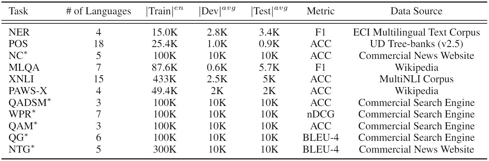
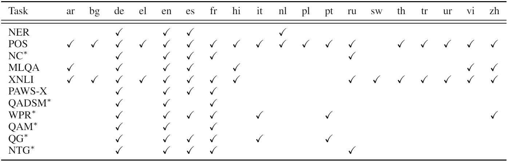

# XGLUE: 
[**Tasks**](#tasks-and-languages) |
[**Dataset**](#get-dataset) |
[**Leaderboard**](https://microsoft.github.io/XGLUE/) |
[**Baseline**](https://github.com/microsoft/Unicoder) |
[**Paper**](https://arxiv.org/abs/2004.01401)

## Updates

* 2020-09-14: Fix the submission email bug.
* 2020-09-14: add two sub-scores "XGLUE-Understanding Score" and "XGLUE-Generation Score" for understanding and generation respectively.
* 2020-11-26: release the test part for better results reproducing.
* 2020-12-09: Fix the submission link bug in github ReadMe.

## Introduction
This repository contains information about the cross-lingual evaluation benchmark XGLUE, which is composed of 11 tasks spans 19 languages.
For each task, the training data is only available in English. This means that to succeed at XGLUE, a model must have a strong zero-shot cross-lingual transfer capability to learn from the English data of a specific task and transfer what it learned to other languages. 
Comparing to its concurrent work XTREME, XGLUE has two characteristics: First, it includes cross-lingual NLU and cross-lingual NLG tasks at the same time; 
Second, besides including 5 existing cross-lingual tasks (i.e. NER, POS, MLQA, PAWS-X and XNLI), XGLUE selects 6 new tasks from Bing scenarios as well, 
including News Classification (NC), Query-Ad Matching (QADSM), Web Page Ranking (WPR), QA Matching (QAM), Question Generation (QG) and News Title Generation (NTG). 
Such diversities of languages, tasks and task origin provide a comprehensive benchmark for quantifying the quality of a pre-trained model on cross-lingual natural language understanding and generation. 

The 11 tasks in XGLUE:



The 19 languages in XGLUE, including Arabic (ar), Bulgarian (bg), German (de), Greek (el), English (en), Spanish (es), French (fr), Hindi (hi), Italian (it), Dutch (nl), Polish (pl), Portuguese (pt), Russian (ru), Swahili (sw), Thai (th), Turkish (tr), Urdu (ur), Vietnamese (vi) and Chinese (zh):



## Tasks and Languages
The 11 tasks in XGLUE can be categorized into 3 groups: single-input understanding tasks, pair-input understanding tasks and generation tasks.
### Single-Input Understanding Tasks

#### NER
We select a subset of the following two NER tasks, CoNLL-2002 NER `\cite{Sang2002IntroductionTT}` and CoNLL-2003 NER `\cite{Sang2003IntroductionTT}`, to form this cross-lingual NER dataset. 
It covers 4 languages, including English, German, Spanish and Dutch, and 4 types of named entities, including Person, Location, Organization and Miscellaneous entities that do not belong to the previous three types. 
F1 score is used as the metric.

#### POS Tagging (POS)
We select a subset of Universal Dependencies (UD) Treebanks (v2.5) `\cite{11234/1-3105}`, which covers 18 languages. 
Accuracy (ACC) of the predicted POS tags is used as the metric.

#### News Classification (NC)
This task aims to predict the category given a news article. 
It covers 5 languages, including English, Spanish, French, German and Russian. 
Each labeled instance is a 3-tuple: <news title, news body, category>.
The category number is 10.
We crawl this dataset from a commercial news website.
Accuracy (ACC) of the multi-class classification is used as the metric.

### Pair-input Understanding Tasks
#### MLQA
The MLQA `\cite{Lewis2019MLQAEC}` is a multilingual machine reading comprehension task, which contains QA annotations labeled in 7 languages, including English, Arabic, German, Spanish, Hindi, Vietnamese and Chinese. 
F1 score of the predicted answers is used as the metric.

#### XNLI
We reuse the original XNLI dataset `\cite{Conneau2018XNLIEC}` in XGLUE.

#### PAWS-X
The PAWS-X `\cite{Yang2019PAWSXAC}` is a paraphrase identification dataset, which extends the Wikipedia portion of the PAWS evaluation to more languages. 
We select 4 languages, including English, Spanish, French and German, from the original dataset and use them in XGLUE. 
Accuracy (ACC) of the binary classification is used as the metric.

#### Query-Ad Matching (QADSM)
This task aims to predict whether an advertisement (ad) is relevant to an input query. 
It covers 3 languages, including English, French and German. 
Each labeled instance is a 4-tuple: <query, ad title, ad description, label>.
The label indicates whether the ad is relevant to the query (Good), or not (Bad). 
We construct this dataset based on a commercial search engine.
Accuracy (ACC) of the binary classification is used as the metric.

#### Web Page Ranking (WPR)
This task aims to predict whether a web page is relevant to an input query. 
It covers 7 languages, including English, German, French, Spanish, Italian, Portuguese and Chinese. 
Each labeled instance is a 4-tuple: <query, web page title, web page snippet, label>. 
The relevance label contains 5 ratings: Perfect (4), Excellent (3), Good (2), Fair (1) and Bad (0). 
We construct this dataset based on a commercial search engine. 
Normalize Discounted Cumulative Gain (nDCG) is used as the metric.

#### QA Matching (QAM)
This task aims to predict whether a <question, passage> pair is a QA pair. 
It covers 3 languages, including English, French and German. 
Each labeled instance is a 3-tuple: <question, passage, label>. The label indicates whether the passage is the answer of the question (1), or not (0). 
We construct this dataset based on a commercial search engine.
Accuracy (ACC) of the binary classification is used as the metric.

### Generation Tasks
#### Question Generation (QG)
This task aims to generate a question for a given passage. 
We collect <passage, question> pairs from a commercial search engine. 
It covers 6 languages, including English, French, German, Spanish, Italian and Portuguese. 
BLEU-4 score is used as the metric.

#### News Title Generation (NTG) 
This task aims to generate a proper title for a given news body. 
We collect <news body, news title> pairs from a commercial news website.
It covers 5 languages, including German, English, French, Spanish and Russian. 
BLEU-4 score is used as the metric.

## Get Dataset
In order to use our dataset, please navigate to [XGLUE Leaderboard](https://microsoft.github.io/XGLUE/) and agree to our terms of service. After you do so a download link will be made available.

## Get Baseline
We put the baseline system to [Unicoder](https://github.com/microsoft/Unicoder) repo. It contains a pre-trained model and fine-tuning scripts for XGLUE.

## Leaderboard Submission
### Submissions
To submit your predictions for evaluation, please create a single folder which contains the 11 sub-folders named after each task (see [reference file](evaluation/Unicoder_prediction_on_XGLUE_test) for an example). 
Inside each folder, create one prediction file for each language and name the file using the following format: `{language}.prediction` where `{language}` is the 2 character [ISO 639-1](https://en.wikipedia.org/wiki/List_of_ISO_639-1_codes) code.
Please validate that you have done this correctly by evaluating against the development file. Once that is done, you could submit your results by emailing them to xglue@microsoft.com.
Your email should include:

* Prediction results on test set. [Required]
* Prediction results on dev set. [Recommended]
* Individual/Team Name: Name of the individual or the team to appear in the leaderboard. [Required]
* Individual/Team Institution: Name of the institution of the individual or the team to appear in the leaderboard. [Optional]
* Model code: Training code for the model. [Recommended]
* Model information: Name of the model/technique to appear in the leaderboard, whether used translated data in fine-tuning, the parameter number of model. [Required]
* Paper Information: Name, Citation, URL of the paper if model is from a published work to appear in the leaderboard. [Optional] 

### Evaluation
To evaluate your model's performance, we will compare your prediction files with the ground truth files.
We are keeping our evaluation data held out but we ask all models first evaluate performance on the development portion of the dataset before submitting their predictions for the evaluation dataset.
To evaluate your performance, please use the following command: 
```
python xglue_evaluate.py --prediction_dir <prediction_files_folder> --ground_truth_dir <ground_truth_dir> --tasks NER,POS,NC,MLQA,XNLI,PAWSX,QADSM,WPR,QAM,QG,NTG --split dev 
```

This file has several dependencies:
```
numpy
sklearn
seqeval
sacrebleu
```

The detailed format of each task is at [Evaluation ReadMe](./evaluation/README.md).
### Baseline
To aid your model comparison we have included the output of our baseline system, unicoder.  Please find the [dev example](evaluation/Unicoder_prediction_on_XGLUE_dev) and [test example](evaluation/Unicoder_prediction_on_XGLUE_test).
## Paper
If you use our benchmark or dataset, please cite our paper `\cite{Liang2020XGLUEAN}`.
```
@article{Liang2020XGLUEAN,
  title={XGLUE: A New Benchmark Dataset for Cross-lingual Pre-training, Understanding and Generation},
  author={Yaobo Liang and Nan Duan and Yeyun Gong and Ning Wu and Fenfei Guo and Weizhen Qi and Ming Gong and Linjun Shou and Daxin Jiang and Guihong Cao and Xiaodong Fan and Ruofei Zhang and Rahul Agrawal and Edward Cui and Sining Wei and Taroon Bharti and Ying Qiao and Jiun-Hung Chen and Winnie Wu and Shuguang Liu and Fan Yang and Daniel Campos and Rangan Majumder and Ming Zhou},
  journal={arXiv},
  year={2020},
  volume={abs/2004.01401}
}
```

Additionally, since XGLUE is also built out of exiting 5 datasets, please ensure you cite all of them. 

An example:
We evaluate our model using the XGLUE benchmark `\cite{Liang2020XGLUEAN}`, a cross-lingual evaluation benchmark consiting of Named Entity Resolution (NER) `\cite{Sang2002IntroductionTT}` `\cite{Sang2003IntroductionTT}`, Part of Speech Tagging (POS) `\cite{11234/1-3105}`, News Classification (NC), MLQA `\cite{Lewis2019MLQAEC}`, XNLI `\cite{Conneau2018XNLIEC}`, PAWS-X `\cite{Yang2019PAWSXAC}`, Query-Ad Matching (QADSM), Web Page Ranking (WPR), QA Matching (QAM), Question Generation (QG) and News Title Generation (NTG).

Bibtex for external datasets used in XGLUE:
```
@misc{11234/1-3105,
  title={Universal Dependencies 2.5},
  author={Zeman, Daniel and Nivre, Joakim and Abrams, Mitchell and Aepli, No{\"e}mi and Agi{\'c}, {\v Z}eljko and Ahrenberg, Lars and Aleksandravi{\v c}i{\=u}t{\.e}, Gabriel{\.e} and Antonsen, Lene and Aplonova, Katya and Aranzabe, Maria Jesus and Arutie, Gashaw and Asahara, Masayuki and Ateyah, Luma and Attia, Mohammed and Atutxa, Aitziber and Augustinus, Liesbeth and Badmaeva, Elena and Ballesteros, Miguel and Banerjee, Esha and Bank, Sebastian and Barbu Mititelu, Verginica and Basmov, Victoria and Batchelor, Colin and Bauer, John and Bellato, Sandra and Bengoetxea, Kepa and Berzak, Yevgeni and Bhat, Irshad Ahmad and Bhat, Riyaz Ahmad and Biagetti, Erica and Bick, Eckhard and Bielinskien{\.e}, Agn{\.e} and Blokland, Rogier and Bobicev, Victoria and Boizou, Lo{\"{\i}}c and Borges V{\"o}lker, Emanuel and B{\"o}rstell, Carl and Bosco, Cristina and Bouma, Gosse and Bowman, Sam and Boyd, Adriane and Brokait{\.e}, Kristina and Burchardt, Aljoscha and Candito, Marie and Caron, Bernard and Caron, Gauthier and Cavalcanti, Tatiana and Cebiro{\u g}lu Eryi{\u g}it, G{\"u}l{\c s}en and Cecchini, Flavio Massimiliano and Celano, Giuseppe G. A. and {\v C}{\'e}pl{\"o}, Slavom{\'{\i}}r and Cetin, Savas and Chalub, Fabricio and Choi, Jinho and Cho, Yongseok and Chun, Jayeol and Cignarella, Alessandra T. and Cinkov{\'a}, Silvie and Collomb, Aur{\'e}lie and {\c C}{\"o}ltekin, {\c C}a{\u g}r{\i} and Connor, Miriam and Courtin, Marine and Davidson, Elizabeth and de Marneffe, Marie-Catherine and de Paiva, Valeria and de Souza, Elvis and Diaz de Ilarraza, Arantza and Dickerson, Carly and Dione, Bamba and Dirix, Peter and Dobrovoljc, Kaja and Dozat, Timothy and Droganova, Kira and Dwivedi, Puneet and Eckhoff, Hanne and Eli, Marhaba and Elkahky, Ali and Ephrem, Binyam and Erina, Olga and Erjavec, Toma{\v z} and Etienne, Aline and Evelyn, Wograine and Farkas, Rich{\'a}rd and Fernandez Alcalde, Hector and Foster, Jennifer and Freitas, Cl{\'a}udia and Fujita, Kazunori and Gajdo{\v s}ov{\'a}, Katar{\'{\i}}na and Galbraith, Daniel and Garcia, Marcos and G{\"a}rdenfors, Moa and Garza, Sebastian and Gerdes, Kim and Ginter, Filip and Goenaga, Iakes and Gojenola, Koldo and G{\"o}k{\i}rmak, Memduh and Goldberg, Yoav and G{\'o}mez Guinovart, Xavier and Gonz{\'a}lez Saavedra, Berta and Grici{\=u}t{\.e}, Bernadeta and Grioni, Matias and Gr{\=u}z{\={\i}}tis, Normunds and Guillaume, Bruno and Guillot-Barbance, C{\'e}line and Habash, Nizar and Haji{\v c}, Jan and Haji{\v c} jr., Jan and H{\"a}m{\"a}l{\"a}inen, Mika and H{\`a} M{\~y}, Linh and Han, Na-Rae and Harris, Kim and Haug, Dag and Heinecke, Johannes and Hennig, Felix and Hladk{\'a}, Barbora and Hlav{\'a}{\v c}ov{\'a}, Jaroslava and Hociung, Florinel and Hohle, Petter and Hwang, Jena and Ikeda, Takumi and Ion, Radu and Irimia, Elena and Ishola, {\d O}l{\'a}j{\'{\i}}d{\'e} and Jel{\'{\i}}nek, Tom{\'a}{\v s} and Johannsen, Anders and J{\o}rgensen, Fredrik and Juutinen, Markus and Ka{\c s}{\i}kara, H{\"u}ner and Kaasen, Andre and Kabaeva, Nadezhda and Kahane, Sylvain and Kanayama, Hiroshi and Kanerva, Jenna and Katz, Boris and Kayadelen, Tolga and Kenney, Jessica and Kettnerov{\'a}, V{\'a}clava and Kirchner, Jesse and Klementieva, Elena and K{\"o}hn, Arne and Kopacewicz, Kamil and Kotsyba, Natalia and Kovalevskait{\.e}, Jolanta and Krek, Simon and Kwak, Sookyoung and Laippala, Veronika and Lambertino, Lorenzo and Lam, Lucia and Lando, Tatiana and Larasati, Septina Dian and Lavrentiev, Alexei and Lee, John and L{\^e} H{\`{\^o}}ng, Phương and Lenci, Alessandro and Lertpradit, Saran and Leung, Herman and Li, Cheuk Ying and Li, Josie and Li, Keying and Lim, {KyungTae} and Liovina, Maria and Li, Yuan and Ljube{\v s}i{\'c}, Nikola and Loginova, Olga and Lyashevskaya, Olga and Lynn, Teresa and Macketanz, Vivien and Makazhanov, Aibek and Mandl, Michael and Manning, Christopher and Manurung, Ruli and M{\u a}r{\u a}nduc, C{\u a}t{\u a}lina and Mare{\v c}ek, David and Marheinecke, Katrin and Mart{\'{\i}}nez Alonso, H{\'e}ctor and Martins, Andr{\'e} and Ma{\v s}ek, Jan and Matsumoto, Yuji and {McDonald}, Ryan and {McGuinness}, Sarah and Mendon{\c c}a, Gustavo and Miekka, Niko and Misirpashayeva, Margarita and Missil{\"a}, Anna and Mititelu, C{\u a}t{\u a}lin and Mitrofan, Maria and Miyao, Yusuke and Montemagni, Simonetta and More, Amir and Moreno Romero, Laura and Mori, Keiko Sophie and Morioka, Tomohiko and Mori, Shinsuke and Moro, Shigeki and Mortensen, Bjartur and Moskalevskyi, Bohdan and Muischnek, Kadri and Munro, Robert and Murawaki, Yugo and M{\"u}{\"u}risep, Kaili and Nainwani, Pinkey and Navarro Hor{\~n}iacek, Juan Ignacio and Nedoluzhko, Anna and Ne{\v s}pore-B{\=e}rzkalne, Gunta and Nguy{\~{\^e}}n Th{\d i}, Lương and Nguy{\~{\^e}}n Th{\d i} Minh, Huy{\`{\^e}}n and Nikaido, Yoshihiro and Nikolaev, Vitaly and Nitisaroj, Rattima and Nurmi, Hanna and Ojala, Stina and Ojha, Atul Kr. and Ol{\'u}{\`o}kun, Ad{\'e}day{\d o}̀ and Omura, Mai and Osenova, Petya and {\"O}stling, Robert and {\O}vrelid, Lilja and Partanen, Niko and Pascual, Elena and Passarotti, Marco and Patejuk, Agnieszka and Paulino-Passos, Guilherme and Peljak-{\L}api{\'n}ska, Angelika and Peng, Siyao and Perez, Cenel-Augusto and Perrier, Guy and Petrova, Daria and Petrov, Slav and Phelan, Jason and Piitulainen, Jussi and Pirinen, Tommi A and Pitler, Emily and Plank, Barbara and Poibeau, Thierry and Ponomareva, Larisa and Popel, Martin and Pretkalni{\c n}a, Lauma and Pr{\'e}vost, Sophie and Prokopidis, Prokopis and Przepi{\'o}rkowski, Adam and Puolakainen, Tiina and Pyysalo, Sampo and Qi, Peng and R{\"a}{\"a}bis, Andriela and Rademaker, Alexandre and Ramasamy, Loganathan and Rama, Taraka and Ramisch, Carlos and Ravishankar, Vinit and Real, Livy and Reddy, Siva and Rehm, Georg and Riabov, Ivan and Rie{\ss}ler, Michael and Rimkut{\.e}, Erika and Rinaldi, Larissa and Rituma, Laura and Rocha, Luisa and Romanenko, Mykhailo and Rosa, Rudolf and Rovati, Davide and Roșca, Valentin and Rudina, Olga and Rueter, Jack and Sadde, Shoval and Sagot, Beno{\^{\i}}t and Saleh, Shadi and Salomoni, Alessio and Samard{\v z}i{\'c}, Tanja and Samson, Stephanie and Sanguinetti, Manuela and S{\"a}rg, Dage and Saul{\={\i}}te, Baiba and Sawanakunanon, Yanin and Schneider, Nathan and Schuster, Sebastian and Seddah, Djam{\'e} and Seeker, Wolfgang and Seraji, Mojgan and Shen, Mo and Shimada, Atsuko and Shirasu, Hiroyuki and Shohibussirri, Muh and Sichinava, Dmitry and Silveira, Aline and Silveira, Natalia and Simi, Maria and Simionescu, Radu and Simk{\'o}, Katalin and {\v S}imkov{\'a}, M{\'a}ria and Simov, Kiril and Smith, Aaron and Soares-Bastos, Isabela and Spadine, Carolyn and Stella, Antonio and Straka, Milan and Strnadov{\'a}, Jana and Suhr, Alane and Sulubacak, Umut and Suzuki, Shingo and Sz{\'a}nt{\'o}, Zsolt and Taji, Dima and Takahashi, Yuta and Tamburini, Fabio and Tanaka, Takaaki and Tellier, Isabelle and Thomas, Guillaume and Torga, Liisi and Trosterud, Trond and Trukhina, Anna and Tsarfaty, Reut and Tyers, Francis and Uematsu, Sumire and Ure{\v s}ov{\'a}, Zde{\v n}ka and Uria, Larraitz and Uszkoreit, Hans and Utka, Andrius and Vajjala, Sowmya and van Niekerk, Daniel and van Noord, Gertjan and Varga, Viktor and Villemonte de la Clergerie, Eric and Vincze, Veronika and Wallin, Lars and Walsh, Abigail and Wang, Jing Xian and Washington, Jonathan North and Wendt, Maximilan and Williams, Seyi and Wir{\'e}n, Mats and Wittern, Christian and Woldemariam, Tsegay and Wong, Tak-sum and Wr{\'o}blewska, Alina and Yako, Mary and Yamazaki, Naoki and Yan, Chunxiao and Yasuoka, Koichi and Yavrumyan, Marat M. and Yu, Zhuoran and {\v Z}abokrtsk{\'y}, Zden{\v e}k and Zeldes, Amir and Zhang, Manying and Zhu, Hanzhi},
  url={http://hdl.handle.net/11234/1-3105},
  note={{LINDAT}/{CLARIAH}-{CZ} digital library at the Institute of Formal and Applied Linguistics ({{\'U}FAL}), Faculty of Mathematics and Physics, Charles University},
  copyright={Licence Universal Dependencies v2.5},
  year={2019} 
 }

@article{Sang2003IntroductionTT,
  title={Introduction to the CoNLL-2003 Shared Task: Language-Independent Named Entity Recognition},
  author={Erik F. Tjong Kim Sang and Fien De Meulder},
  journal={ArXiv},
  year={2003},
  volume={cs.CL/0306050}
}

@article{Sang2002IntroductionTT,
  title={Introduction to the CoNLL-2002 Shared Task: Language-Independent Named Entity Recognition},
  author={Erik F. Tjong Kim Sang},
  journal={ArXiv},
  year={2002},
  volume={cs.CL/0209010}
}

@inproceedings{Conneau2018XNLIEC,
  title={XNLI: Evaluating Cross-lingual Sentence Representations},
  author={Alexis Conneau and Guillaume Lample and Ruty Rinott and Adina Williams and Samuel R. Bowman and Holger Schwenk and Veselin Stoyanov},
  booktitle={EMNLP},
  year={2018}
}

@article{Lewis2019MLQAEC,
  title={MLQA: Evaluating Cross-lingual Extractive Question Answering},
  author={Patrick Lewis and Barlas Oguz and Ruty Rinott and Sebastian Riedel and Holger Schwenk},
  journal={ArXiv},
  year={2019},
  volume={abs/1910.07475}
}

@article{Yang2019PAWSXAC,
  title={PAWS-X: A Cross-lingual Adversarial Dataset for Paraphrase Identification},
  author={Yinfei Yang and Yuan Zhang and Chris Tar and Jason Baldridge},
  journal={ArXiv},
  year={2019},
  volume={abs/1908.11828}
}
```
# Contributing

This project welcomes contributions and suggestions.  Most contributions require you to agree to a
Contributor License Agreement (CLA) declaring that you have the right to, and actually do, grant us
the rights to use your contribution. For details, visit https://cla.opensource.microsoft.com.

When you submit a pull request, a CLA bot will automatically determine whether you need to provide
a CLA and decorate the PR appropriately (e.g., status check, comment). Simply follow the instructions
provided by the bot. You will only need to do this once across all repos using our CLA.

This project has adopted the [Microsoft Open Source Code of Conduct](https://opensource.microsoft.com/codeofconduct/).
For more information see the [Code of Conduct FAQ](https://opensource.microsoft.com/codeofconduct/faq/) or
contact [opencode@microsoft.com](mailto:opencode@microsoft.com) with any additional questions or comments.

# Legal Notices

Microsoft and any contributors grant you a license to the Microsoft documentation and other content
in this repository under the [Creative Commons Attribution 4.0 International Public License](https://creativecommons.org/licenses/by/4.0/legalcode),
see the [LICENSE](LICENSE) file, and grant you a license to any code in the repository under the [MIT License](https://opensource.org/licenses/MIT), see the
[LICENSE-CODE](LICENSE-CODE) file.

Microsoft, Windows, Microsoft Azure and/or other Microsoft products and services referenced in the documentation
may be either trademarks or registered trademarks of Microsoft in the United States and/or other countries.
The licenses for this project do not grant you rights to use any Microsoft names, logos, or trademarks.
Microsoft's general trademark guidelines can be found at http://go.microsoft.com/fwlink/?LinkID=254653.

Privacy information can be found at https://privacy.microsoft.com/en-us/

Microsoft and any contributors reserve all other rights, whether under their respective copyrights, patents,
or trademarks, whether by implication, estoppel or otherwise.
